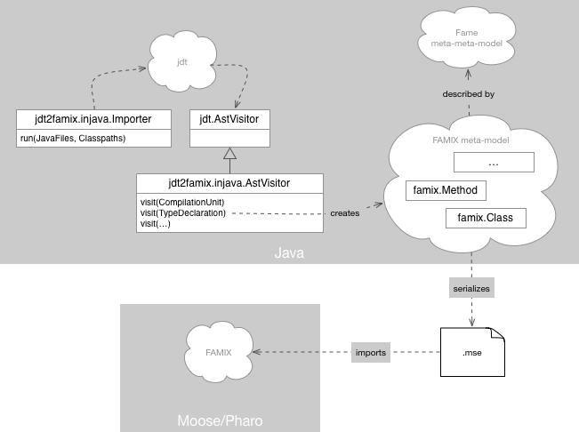

This project offers the mechanism for producing MSE files out of Java code. It is based on [JDT Core](https://projects.eclipse.org/projects/eclipse.jdt.core) and [Fame for Java](https://github.com/girba/FameJava), and it requires Java 8.

# Overview

# Installation

## Run a release
1. [Download a binary release](https://github.com/girba/jdt2famix/releases)
2. The downloaded folder contains all jar files and a `jdt2famix.sh` script (`jdt2famix.cmd` for Windows)

## Create a binary release from sources
1. Clone or download this repository
2. Make sure you have [Maven](https://maven.apache.org/download.cgi) installed and that `mvn` is in the execution path (i.e., change `$PATH`) 
3. Execute in the root folder: `release.sh`
4. This created a `./release` folder that includes all jar files and a `jdt2famix.sh` script (`jdt2famix.cmd` for Windows)

# How to create an MSE model from a target system
Suppose you have a `mysystem` root folder in which you have the sources and all jar dependencies of your target Java system.

After having created the release, go to `mysystem`, and execute `/path/to/jdt2famix.sh` (`/path/to/jdt2famix.cmd` for Windows). This will result in an MSE file named like the folder of your target system (in our case `mysystem.mse`).

You can now import the `mysystem.mse` file into [Moose](http://moosetechnology.org). 

## The importance of including external dependencies

It is important to have all external dependencies in a subfolder of `mysystem`. This ensures that the importer can correctly identify dependencies to outside entities. Consider the following example of a class definition 

	@ExternalAnnotation
	public class MyClass extends ExternalClass { ... }

In order to describe completely `MyClass`, we need to extract information about all its immediate dependencies. For example, in our case we need to have information about `ExternalClass` and `@ExternalAnnotation`. That is why, we need to have the external libraries available in the Classpath of the importer. As the importer automatically retrieves all jars/ears/wars from the root folder of `mysystem`, it is enough to place these dependencies somewhere under that folder.  

## A note about Maven projects

If you happen to have a Java project that defines dependencies through Maven, you can use the following command to copy all dependencies:

	mvn dependency:copy-dependencies -DoutputDirectory=dependencies -DoverWriteSnapshots=true -DoverWriteReleases=false

## Understanding import problems through logging

jdt2famix logs the problems encountered during import.

These problems do not stop the import, but they do lead to loss of information quality in the model. These problems are typically due to missing jars in the classpath, and if you know which parts are problematic, you get a chance of fixing them.

To give you an example, entries might look like this:

    unresolved type declaration - TestPlatform - .../jdt2famix/tmp/guava/guava-tests/test/com/google/common/math/TestPlatform.java - line 21
    unresolved method declaration - suite - .../jdt2famix/tmp/guava/guava-tests/test/com/google/common/primitives/ByteArrayAsListTest.java - line 51

For example, in the case of guava, importing just the checked out code, gives us 419 problems, most of which were method declaration problems (due to unknown return types). However, after downloading all jars from the maven dependencies, we got only 47 problems (only type declaration problems, but no more method declaration problems). Interestingly, guava is made out of several sub-projects, and these problems appear if we import the overall project. But, if we import only a subproject at a time, the problems do not appear anymore, so likely the issue is related to conflicting jars, or duplicated sources.

# License
* The main code of the jdt2famix is released under [Eclipse Public License - v 1.0](http://wiki.eclipse.org/EPL).
* JDT Core is used as an external binary library available under [Eclipse Public License - v 1.0](http://wiki.eclipse.org/EPL).
* Fame is used as an external binary library available under [GNU LESSER GENERAL PUBLIC LICENSE, Version 3, 29 June 2007](https://www.gnu.org/licenses/lgpl-3.0.en.html). 
